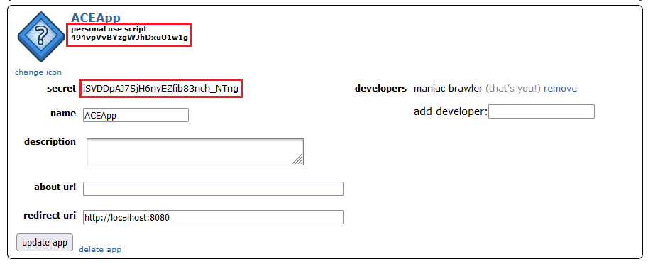
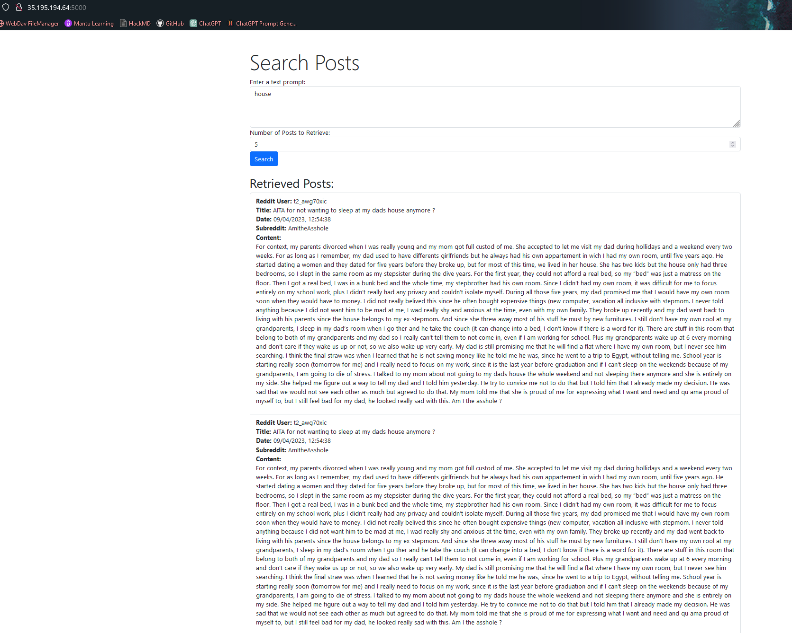

# ACE Certification Project Tutorial


**Synopsis:**

We want to build an application that retrieve Reddit posts related to a specific request made by the user. The user can write the request he wants in a textbox, with some given parameters such as the number of post to retrieve. We need to track latest posts on our subreddits with an acceptable delay and keep older posts too.

## Part 0: Introduction steps

### Step 0.1: Understand the project architecture


### Step 0.2: Estimate your Project services cost

* click on this link to use the Google estimator tool: [Google Cloud Pricing Calculator](https://cloud.google.com/products/calculator)

> You have one main service in terms of cost (Other services used are negligible), this is GKE

* Try to predict your GKE cluster based on Elasticsearch documentations and the following information:

* Compare your estimation to [this one](https://cloud.google.com/products/calculator/#id=ab527a5b-d906-4517-a833-109b606d579b). If you have a different configuration, this is not always a problem. This estimation in based on used resources in an auto-pilot GKE cluster. Just try to understand what is really necessary by yourself.

### Step 0.3: Create the project

* Go on your [GCP console](https://console.cloud.google.com/welcome/new) and create a new project *ACEProject*, then select it.
* using **Cloud Monitoring**, create a new dashboard for this project.

## Part 1: Set up your Elasticsearch Service

### Step 1.1: Create your GKE cluster for all your services

* Enable the **Google Kubernetes Engine** API.
* Create your Kubernetes cluster using these specifications (feel free to try others):
    * select standard cluster type in the top-right corner (needed for next service firewall configurations).
    * if a specification is not mentioned, let the default value.

|       Tab       | Specification name        | value                |
|:---------------:|:------------------------- |:-------------------- |
| Clusters basics | cluster name              | ace-services-cluster |
| Clusters basics | location type             | regional             |
| Clusters basics | region                    | europe-west1         |
|  default-pool   | node pool size            | 1                    |
|  default-pool   | enable cluster autoscaler | true                 |
|      Nodes      | machine series            | e2                   |
|      Nodes      | machine type              | e2-standard-2        |
|      Nodes      | boot disk size            | 65 GB                |
|   Networking    | DNS provider              | Cloud DNS            |

### Step 1.2: Setup Elasticsearch Operator

* Wait a couple of minutes for your cluster to create, then connect to it using Cloud Shell or your local terminal:
    * ```gcloud container clusters get-credentials ace-services-cluster --region europe-west1 --project PROJECT_ID```
* install Elastic resources:
    * ```kubectl create -f https://download.elastic.co/downloads/eck/2.9.0/crds.yaml```
* install the Elastic Operator (automatic clusters manager):
    * ```kubectl apply -f https://download.elastic.co/downloads/eck/2.9.0/operator.yaml```


### Step 1.3: Deploy your Elasticsearch cluster

* apply this [kubernetes manifest](config/kubernetes_manifests/elasticsearch_service/es_deploy_with_load_balancer.yaml) to create your cluster and deploy it with a load balancer and a persistent storage:
    * ```kubectl apply -f es_deploy_with_load_balancer.yaml```
* what few seconds for ES services to finish to deploy, you can check using this command:
    * ```kubectl get services```
    * you need to have the external IP address for your *reddit-cluster-es-http*.
* now you can test to request your ES service:
    * ```PASSWORD=$(kubectl get secret quickstart-es-elastic-user -o go-template='{{.data.elastic | base64decode}}')```
    * in another terminal (stay locally or on Cloud Shell, don't mix these solutions), open forward the service port on localhost:
        * ```kubectl port-forward service/reddit-cluster-es-http 9200```
    * on your first terminal, request your service:
        * ```curl -u "elastic:$PASSWORD" -k "https://localhost:9200"```
        * you want to see something like this:
```json
{
  "name" : "reddit-cluster-es-default-1",
  "cluster_name" : "reddit-cluster",
  "cluster_uuid" : "_na_",
  "version" : {
    "number" : "8.9.1",
    "build_flavor" : "default",
    "build_type" : "docker",
    "build_hash" : "a813d015ef1826148d9d389bd1c0d781c6e349f0",
    "build_date" : "2023-08-10T05:02:32.517455352Z",
    "build_snapshot" : false,
    "lucene_version" : "9.7.0",
    "minimum_wire_compatibility_version" : "7.17.0",
    "minimum_index_compatibility_version" : "7.0.0"
  },
  "tagline" : "You Know, for Search"
}
```

### Step 1.4: Deploy a Kibana Instance to help you manage your Elasticsearch cluster

* using [this manifest](config/kubernetes_manifests/kibana_service/kibana_node.yaml), create a Kibana service:
    * ```kubectl apply -f kibana_node.yaml```
* access kibana user interface by running this command locally:
    * ```kubectl port-forward service/reddit-cluster-kb-http 5601```
* now you have access to Kibana at [this address](https://localhost:5601/):
    * username: elastic
    * password: same as password in PASSWORD env variable we set before.
* go to [Security/roles](https://localhost:5601/app/management/security/roles) and create two roles:
    * privileges are associated with *reddit_post_index* index for our two roles.

|          Role           | Privileges                                     |
|:-----------------------:|:---------------------------------------------- |
| reddit-post-index-read  | read, read_cross_cluster, view_index_metadata  |
| reddit-post-index-write | write, create_doc, auto_configure, maintenance |

* go to [Security/users](https://localhost:5601/app/management/security/users) and create two users:
    * for each user, create a strong password and keep it locally for the moment.

|      User      | Roles                   |
|:--------------:|:----------------------- |
|    web-app     | reddit-post-index-read  |
| cronjob-reddit | reddit-post-index-write |


### Step 1.5: ADD your secret credentials in GKE cluster

* for future connection using Python Elasticsearch client, we need to keep the IP address and the port encrypted. Use this [kubernetes manifest](config/kubernetes_manifests/elasticsearch_service/es_secret.yaml) to add your credentials:
    * ```kubectl create -f es_secret.yaml```

## Part 2: Set up your Reddit API Cronjob

### Step 2.1 (Optional): Connect to Reddit API

* create a Reddit account [here](https://www.reddit.com/register/)
* create a [new reddit API app](https://www.reddit.com/prefs/apps):
    * app name: ACEApp
    * app type: script
    * redirect uri: http://localhost:8080
* get your Client ID and App secret as you can see in the next screenshot:


* using these credentials, get your refresh token using this [Python script](src/cronjob_reddit/refresh_token.py).

### Step 2.2: Create your cronjob application

* Write a Python script to retrieve new posts from Reddit API and push them to the Elasticsearch Index. You can find the following code [here](src/cronjob_reddit/reddit_api_scrapper.py). Please follow this help instructions:
    * your Elasticsearch connector use SSL certificates to encrypt data, your certificate is on a env variable set on your deploy manifest (defined later). you just need to write the certificate to a file a give the file to your connector.
    * your connector will need the username and password according to the defined user in Kibana.
    * please add some logs to help you to debug in case of error.
* you want to store your secret credentials in a secure location, so write your credentials in this [Kubernetes manifest](config/kubernetes_manifests/cronjob_reddit/cronjob_reddit_secret.yaml) AFTER a base64 encoding, for example:
    * ```echo -n "cronjon-reddit" | base64```
* apply this manifest in your GKE cluster:
    * ```kubectl create -f cronjob_reddit_secret.yaml```

### Step 2.3: Set up your Artifact Image Registry

* Go to Artifact Registry in your GCP Console.
* Create a new repository *cronjob-reddit*.
* set up your Cloud shell or local terminal for this Artifact region:
    * ```gcloud auth configure-docker europe-west1-docker.pkg.dev```

### Step 2.4: Deploy your cronjob application on GKE

* Now we need to create an image to deploy your cronjob app, a good practice is to begin with creating your Makefile. A Makefile example is [here](Makefile)
    * write a rule for building your image using [this Dockerfile](config/cronjob_reddit/Dockerfile)
    * and another rule for pushing this image to your Artifact Registry.
* build your image:
    * ```make build-image-cronjob```
* push this image:
    * ```make push-image-cronjob```
* Using [this manifest](config/kubernetes_manifests/cronjob_reddit/cronjob_reddit.yaml), create your cronjob (you will need to put your image url from artifact registry):
    * ```kubectl create -f cronjob_reddit.yaml```
* you can test if the cronjob is doing what expected by checking the logs:
    * wait for the cronjob to run a job: ```kubectl get cronjob -w```
    * get your cronjob pod id: ```kubectl get pods```
    * once a job is launched, wait for the pod to be up and check the log: ```kubectl logs POD_ID```


## Part 3: Set up your Web interface application

### Step 3.1: Create your Web application

* Implement the web application you want using the framework you want, It doesn't matter.
    * If you want something fast to test, just build a FastAPI with a simple POST request.
* you also want to store these secret credentials in a secure location, so write your credentials in this [Kubernetes manifest](config/kubernetes_manifests/web_app/app_secret_without_firestore.yaml) AFTER a base64 encoding again.
* apply this secret manifest in your GKE cluster:
    * ```kubectl create -f app_secret.yaml```

### Step 3.2: Set up your Artifact Image Registry

* Go to Artifact Registry in your GCP Console.
* Create a new repository *web-app*.

### Step 3.3: Deploy your Web App

* Update your Makefile with two rules similar to your cronjob rules:
    * one for building your image
    * one for tagging and pushing your image on Artifact registry
* build your image:
    * ```make build-image-app```
* push your image:
    * ```make push-image-app```
* deploy your application using [this manifest](config/kubernetes_manifests/web_app/app_deploy_without_firestore.yaml):
    * ```kubectl apply -f app_deploy.yaml```
* wait a bit and go see one pod to check if the app is running.
* deploy a load balancer using [this manifest](config/kubernetes_manifests/web_app/app_service.yaml) for the app to open it externally:
    * ```kubectl apply -f app_service.yaml```
* your app is running, you can fully test it now using the external IP address of the load balancer and the port you set:



## Part 4: Add a Database for user Request/Index Answer

### Step 4.1: Create a Firestore Database

* Go to Firestore on the GCP Console.
* Create a new Database:
    * choose Native mode
    * select europe-west4 as zone because this is the closest one to our GKE cluster zone

### Step 4.2: Setup Workload Identity for you Web Application

* follow [this tutorial](https://cloud.google.com/kubernetes-engine/docs/how-to/workload-identity?hl=fr#enable-existing-cluster) to create a service account for your web app and enable to connect to Firestore Database.

### Step 4.3: Update your Web Application to push data in this Database

* To automatically connect to Firestore using Google managed credentials, use the following code in your Web App:
```python
from google.auth import default
from google.cloud import firestore

cred, _ = default()
firestore_db = firestore.Client(
    project=os.getenv("project_id"), # project_id var env need to be set using kubernetes secret and deploy manifest.
    credentials=cred,
)
```
* Now, update your Web App code to send datas to Firestore, we want te store a document per user request with:
    * user prompt
    * number of posts requested
    * all posts:
        * all the information, not only the text.
* build your image:
    * ```make build-image-app```
* push and tag your image:
    * ```make push-image-app```
* update your web [app deploy manifest](config/kubernetes_manifests/web_app/app_deploy.yaml) and [secret manifest](config/kubernetes_manifests/web_app/app_secret.yaml) like these linked manifests.
* create your new secret after deleting the old version:
    * ```kubectl delete secret web-app-es-service-credentials && kubectl create -f app_secret.yaml```
* deploy your new web application:
    * ```kubectl apply -f app_deploy.yaml```
* deploy it externally using a load balancer:
    * ```kubectl apply -f app_service.yaml```
* Done ! You normally could see your requested logs in the firestore database on GCP console.

## Part 5: Network Security and Service Firewall

### Step 5.1: Get your Applications IP addresses

* on your Cloud Shell or local terminal, get your Web Application IP address:
    * ```kubectl get service```
    * you need to take the EXTERNAL-IP
* then you need the possible range of IP address for the entire GKE cluster, because our cronjob pods don't have specific IP address.
* Go to Kubernetes Clusters on your GCP Console
* select your GKE cluster, and check the value of *IPv4 service range*, write it somewhere.


### Step 5.2: Create your Elasticsearch service Firewall

* our Web Application and Cronjob are set up to connect to Elasticsearch cluster using the load balancer IP address. We want to secure the elasticsearch cluster using a firewall.
* Go to VPC Network on your GCP Console.
* Go to Firewall Policies on the left tab.
* Create a new Firewall rule:
    * change the IP address macro with your specific service IP addresses.

| parameter name       |                     Value                     |
| -------------------- |:---------------------------------------------:|
| name                 |              ingress-es-firewall              |
| direction of traffic |                    ingress                    |
| targets              |             specified target tags             |
| target tags          |            reddit-cluster-es-http             |
| sources IPV4 ranges  | WEB_APP_ID_ADDRESS, GKE_CLUSTER_IPV4_IP_RANGE |
